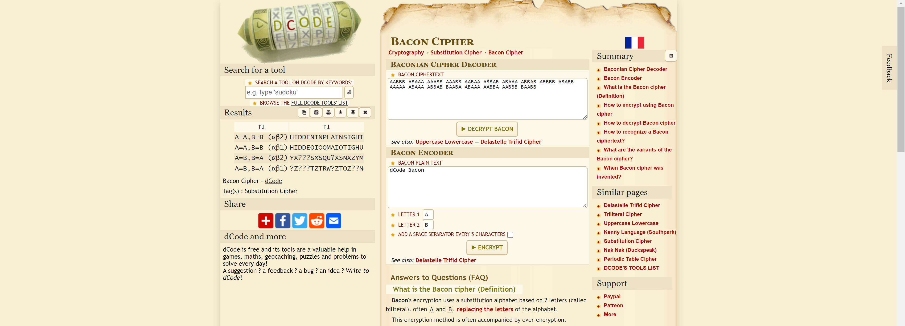

# Bacon for Breakfast
> 25pts

## Category
> Crypto

## Briefing
> Bacon’s cipher or the Baconian cipher is a method of steganography (a method of hiding a secret message as opposed to just a cipher) devised by Francis Bacon in 1605. A message is concealed in the presentation of text, rather than its content. The Baconian cipher is a substitution cipher in which each letter is replaced by a sequence of 5 characters.There are two versions of this cipher. We have collected a chart for one of them.

> Can you decrypt the message below?

> AABBB ABAAA AAABB AAABB AABAA ABBAB ABAAA ABBAB ABBBB ABABB AAAAA ABAAA ABBAB BAABA ABAAA AABBA AABBB BAABB

## Solution
The provided file can be found [here](bacon_table.png).

[decode.fr](https://www.dcode.fr/bacon-cipher) make light work of this challenge:

## Flag
Flag: `HIDDENINPLAINSIGHT`