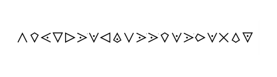

# Order of the Temple
> 25pts

## Category
> Crypto

## Briefing
> The members of the Order of the Temple, a religious and military group from the Middle Ages were known as the Knights Templar. They invented a way to move money around safely. They kept the money in their castle, but gave the person a note to hand in at a castle in another country. The Knight there gave them money for the note. The Templars used encryption in their communications. The notes were therefore (possibly) encrypted so were useless if stolen. Only the Templar's could read them. We have collected a chart mapping each symbol to specific letter for this cipher.

> Can you decrypt the message in this picture below?

## Solution
The provided file can be found [here](templar_table.png).

Simply use the provided files to decipher the message.

## Flag
Flag: `cipherofwarriormonks`