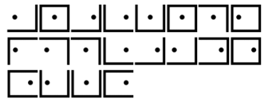

# Rosicrucian Brotherhood
> 25pts

## Category
> Crypto

## Briefing
> Between 1614 and 1617, three anonymous manifestos were published, first in Germany and later throughout Europe. The manifestos caused excitement throughout Europe by declaring the existence of a secret brotherhood of alchemists and sages who were preparing to transform the arts and sciences, and religious, political, and intellectual landscapes of Europe. They released a cipher which is known to be a variation of the pigpen cipher. We have collected a chart that maps each symbol to a letter for this cipher.

> Can you decrypt the message in this picture below?

## Solution
The provided file can be found [here](rosicrucian_table.png).

Simply use the provided modified Pigpen Cipher chart to decipher the message.

## Flag
Flag: `ancientmysticalorder`