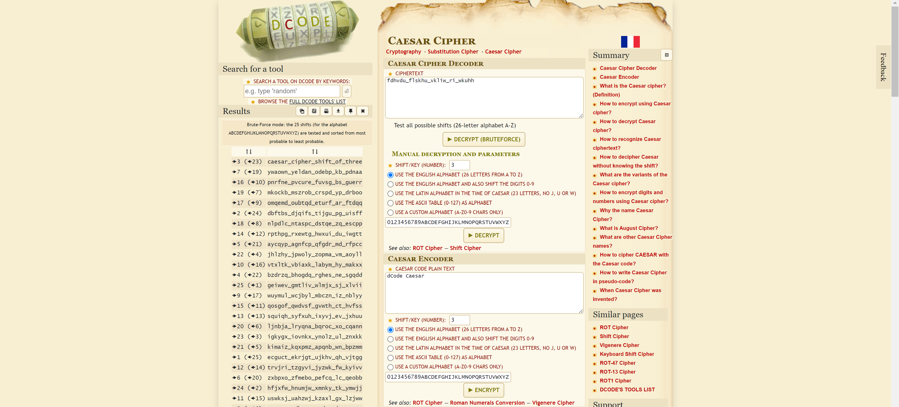

# The name's Caesar
> 25pts

## Category
> Crypto

## Briefing
> Gaius Julius Caesar was a Roman general and statesman who played a critical role in the events that led to the demise of the Roman Republic and the rise of the Roman Empire. To protect messages of military significance, he used to write them in cipher, that is, by so changing the order of the letters of the alphabet, that not a word could be made out. If anyone wishes to decipher these, and get at their meaning, he must substitute the fourth letter of the alphabet, namely D, for A, and so with the others. Can you decrypt the message below?

> fdhvdu_flskhu_vkliw_ri_wkuhh

## Solution
[decode.fr](https://www.dcode.fr/caesar-cipher) make light work of this challenge:

## Flag
Flag: `caesar_cipher_shift_of_three`