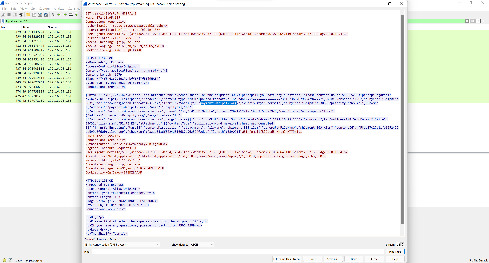

# 0x03 Bacon Shipment
> 25pts

## Category
> Forensics

## Briefing
> Who sent the email with attachment?

> Flag format: flag{email}

## Solution
Looking at the files sent within NetworkMiner show `shipment_303.xlsm` was sent across the network.

Applying the filter `tcp.stream eq 18` within Wireshark and following the conversation shows us who sent the email:

## Flag
Flag: `flag{payments@shipify.org}`