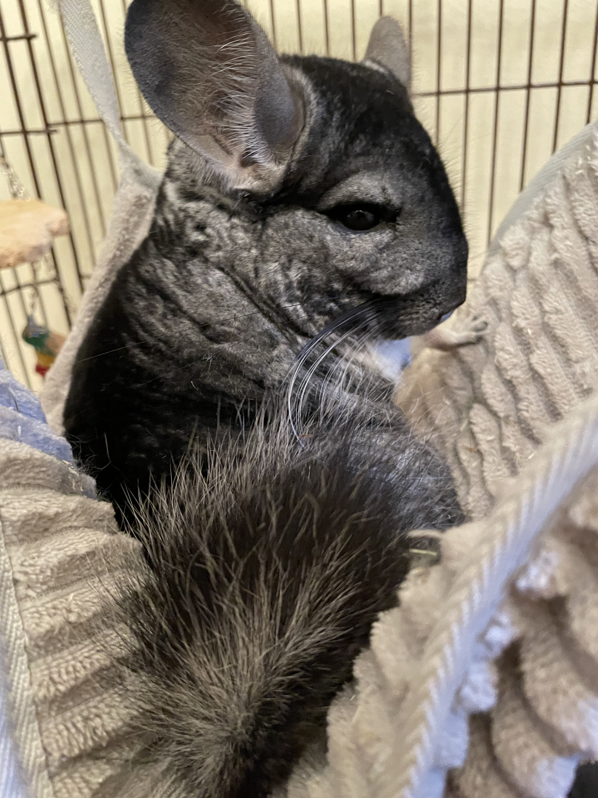

# 0x01 Cuzco's Great Adventure Flag
> 20pts

## Category
> Crypto

## Briefing
> Chinchilla Challenge: Cuzco’s Great Adventure



> Cuzco, the chinchilla, had always wanted to go on a grand adventure. She was boxed in, surrounded on all four sides by walls, but she was getting faster. If she could 10x (a term for upskilling a lot) her skills, continue her practice jumps and codebreaking, then maybe she could break through her walls, and get to that Parkour class she wanted to take.

> Just out of her reach was a folded paper, which she thought might contain more Parkour info. One day she spotted a ciphered clue fluttering near a lock and she thought it might help her break through her gate.

> Crack the following message to help Cuzco with flag 2. For flag 1, what method is used to obfuscate the message?

> Gb oernx guebhtu guvf jnyy lbh zhfg svaq guvf ybpx.

## Solution
```console
CDSkids@kali:~/Desktop$ echo "Gb oernx guebhtu guvf jnyy lbh zhfg svaq guvf ybpx." | tr '[A-Za-z]' '[N-ZA-Mn-za-m]'
To break through this wall you must find this lock.
```

## Flag
Flag: `Caesar Cipher`