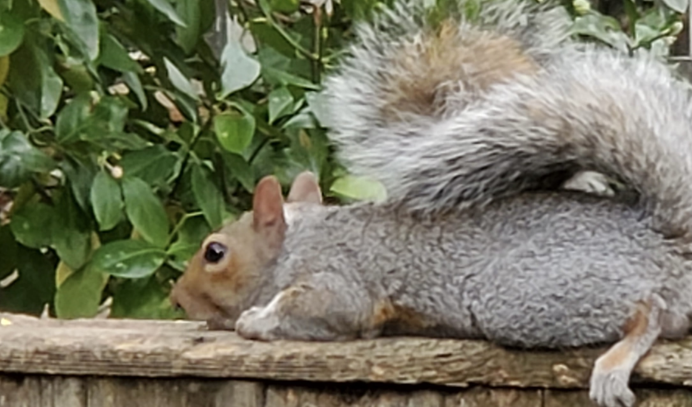

# 0x07 Cuzco's Great Adventure Flag
> 20pts

## Category
> OSINT

## Briefing

> She was starting to build a community. Next, she wanted to work on balance; both in the physical sense, as it is important for parkour and also in the sense of making sure that she wasn’t doing too many things.

> She’d heard of PancakesCon and that it was a place where people celebrated knowledge of information security and having passions outside of cybersecurity. To learn more about this she listened to some talks from past years.

> What was Shecky’s talk title from PancakesCon 2 in 2021 with the theme “We Persevere”?

## Solution
Googling `Shecky’s talk title from PancakesCon 2 in 2021` quickly gives us the talk `PancakesCon 2 - Shecky - Avoiding Burnout, and Exciting Train Facts` on [YouTube](https://www.youtube.com/watch?v=L65_EE18zwY).

## Flag
Flag: `Avoiding Burnout, And Exciting Train Facts`