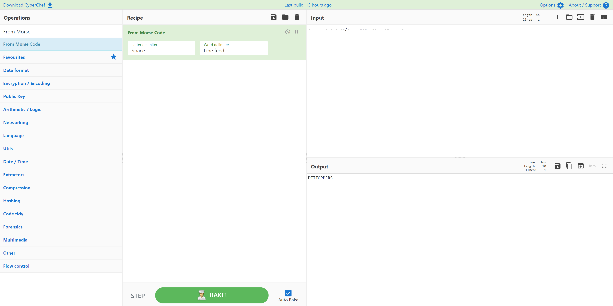

# AFSC 29331
> 10pts

## Category
> Crypto

## Briefing
> -.. .. - - -.--/-... --- .--. .--. . .-. ...

> Note: Not the standard flag format

## Solution
[CyberChef](https://gchq.github.io/CyberChef/#recipe=From_Morse_Code('Space','Line%20feed')&input=LS4uIC4uIC0gLSAtLi0tLy0uLi4gLS0tIC4tLS4gLi0tLiAuIC4tLiAuLi4) quickly decodes this Morse Code:

## Flag
Flag: `Ditty Boppers`