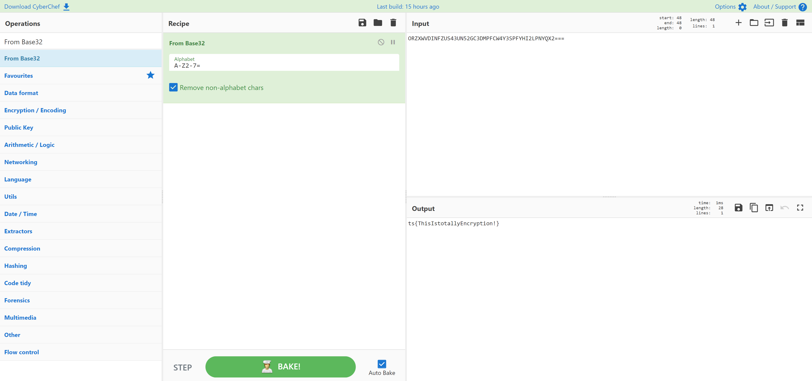

# All About That Base Remix
> 10pts

## Category
> Crypto

## Briefing
> ORZXWVDINFZUS43UN52GC3DMPFCW4Y3SPFYHI2LPNYQX2===

## Solution
[CyberChef](https://gchq.github.io/CyberChef/#recipe=From_Base32('A-Z2-7%3D',true)&input=T1JaWFdWRElORlpVUzQzVU41MkdDM0RNUEZDVzRZM1NQRllISTJMUE5ZUVgyPT09) quickly decodes this Base32:

## Flag
Flag: `ts{ThisIstotallyEncryption!}`