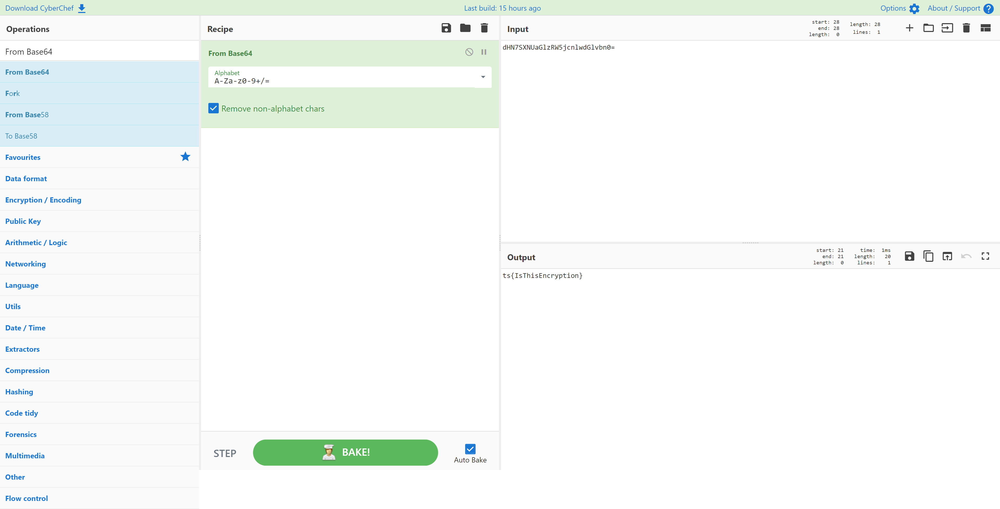

# All About That Base
> 10pts

## Category
> Crypto

## Briefing
> dHN7SXNUaGlzRW5jcnlwdGlvbn0=

## Solution
[CyberChef](https://gchq.github.io/CyberChef/#recipe=From_Base64('A-Za-z0-9%2B/%3D',true)&input=ZEhON1NYTlVhR2x6Ulc1amNubHdkR2x2Ym4wPQ) quickly decodes this Base64:

## Flag
Flag: `ts{IsThisEncryption}`