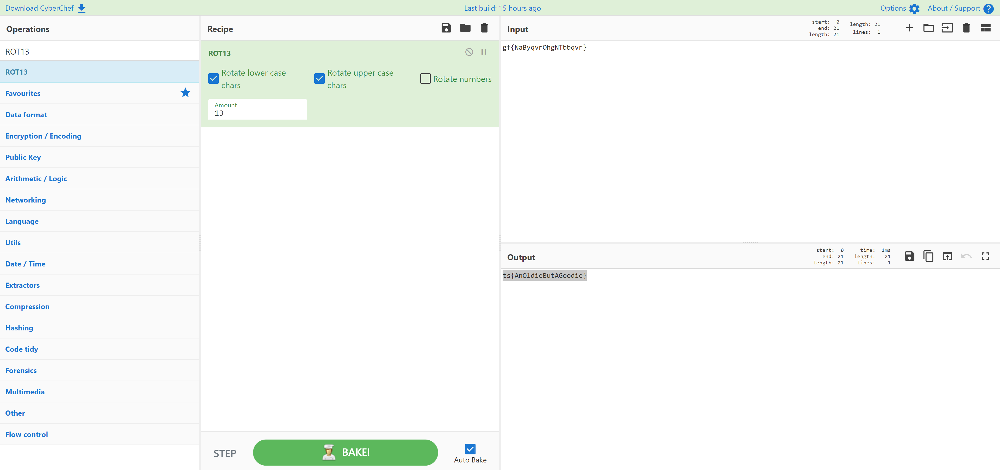

# Et Tu Brute
> 10pts

## Category
> Crypto

## Briefing
> gf{NaByqvrOhgNTbbqvr}

## Solution
[CyberChef](https://gchq.github.io/CyberChef/#recipe=ROT13(true,true,false,13)&input=Z2Z7TmFCeXF2ck9oZ05UYmJxdnJ9) quickly decodes this encrypted message:

## Flag
Flag: `ts{AnOldieButAGoodie}`