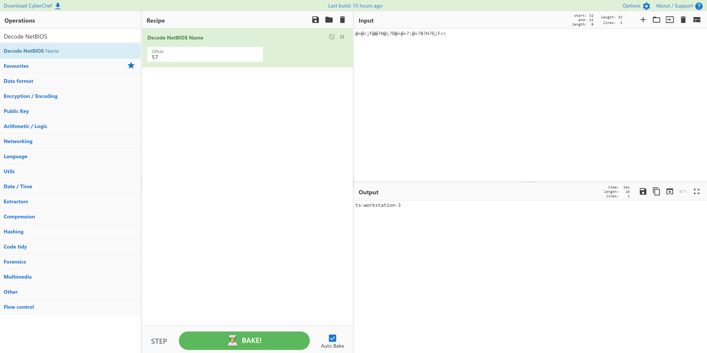

# Non-Standard NetBIOS Offset
> 10pts

## Category
> Crypto

## Briefing
> @=@<;F@@?H@;?D@<@=?:@=?B?H?G;F<<

> Note: Not the standard flag format

## Solution
[CyberChef](https://gchq.github.io/CyberChef/#recipe=Decode_NetBIOS_Name(57)&input=QD1APDtGQEA/SEA7P0RAPEA9PzpAPT9CP0g/RztGPDw) quickly decodes this encrypted message:

## Flag
Flag: `ts-workstation-3`