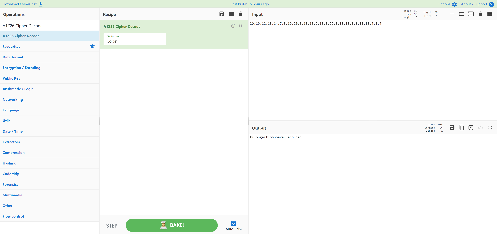

# Why Are They Even In That Order In The First Place
> 10pts

## Category
> Crypto

## Briefing
> 20:19:12:15:14:7:5:19:20:3:15:13:2:15:5:22:5:18:18:5:3:15:18:4:5:4

> Note: Not the standard flag format

## Solution
[CyberChef](https://gchq.github.io/CyberChef/#recipe=A1Z26_Cipher_Decode('Colon')&input=MjA6MTk6MTI6MTU6MTQ6Nzo1OjE5OjIwOjM6MTU6MTM6MjoxNTo1OjIyOjU6MTg6MTg6NTozOjE1OjE4OjQ6NTo0) quickly decodes this encrypted message:

## Flag
Flag: `tslongestcomboeverrecorded`