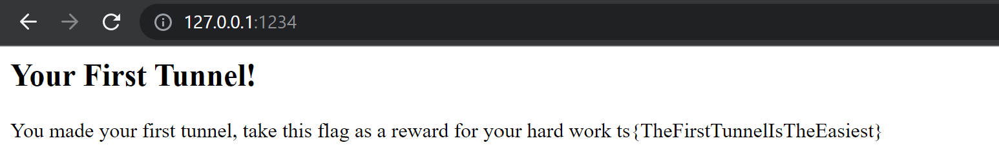

# 0x02 Browsing Websites
> 50pts

## Category
> Network

## Briefing
> Browse to http://10.174.12.14/

## Solution
```console
CDSkids@kali:~/Desktop$ssh -L 1234:10.174.12.14:80 tunneler@tunneler.threatsims.com -p 2222
tunneler@tunneler.threatsims.com's password:
Welcome to Ubuntu 20.04.4 LTS (GNU/Linux 4.15.0-171-generic x86_64)

 * Documentation:  https://help.ubuntu.com
 * Management:     https://landscape.canonical.com
 * Support:        https://ubuntu.com/advantage

This system has been minimized by removing packages and content that are
not required on a system that users do not log into.

To restore this content, you can run the 'unminimize' command.
Last login: Thu Mar 24 00:59:11 2022 from 90.242.2.42
.___________. __    __  .__   __. .__   __.  _______  __       _______ .______
|           ||  |  |  | |  \ |  | |  \ |  | |   ____||  |     |   ____||   _  \
`---|  |----`|  |  |  | |   \|  | |   \|  | |  |__   |  |     |  |__   |  |_)  |
    |  |     |  |  |  | |  . `  | |  . `  | |   __|  |  |     |   __|  |      /
    |  |     |  `--'  | |  |\   | |  |\   | |  |____ |  `----.|  |____ |  |\  \----.
    |__|      \______/  |__| \__| |__| \__| |_______||_______||_______|| _| `._____|

ts{SSHtoANonStandardPort}

Bastion Hosts are an amazing way to provide secure access from a public internet to a private subnet.

A secure deployment of a bastion host would only allow users to ssh in with a ssh private key. We already failed and left ours open with a password, you should never do that.

We also put our SSH server on port 2222, this doesn't offer any security.  It just cuts down on the amount of logging we get from people scanning our host with tools like shodan.

The first challenge is to forward a port or forward tunnel to view a web server on an internal network.  The address is 10.174.12.14 and it is listening on port 80.

The second challenge is to connect to the pivot host.  The address is 10.218.176.199 with user: whistler and password: cocktailparty
```

Navigating to `http://127.0.0.1:1234/` reveals the following:



## Flag
Flag: `ts{TheFirstTunnelIsTheEasiest}`